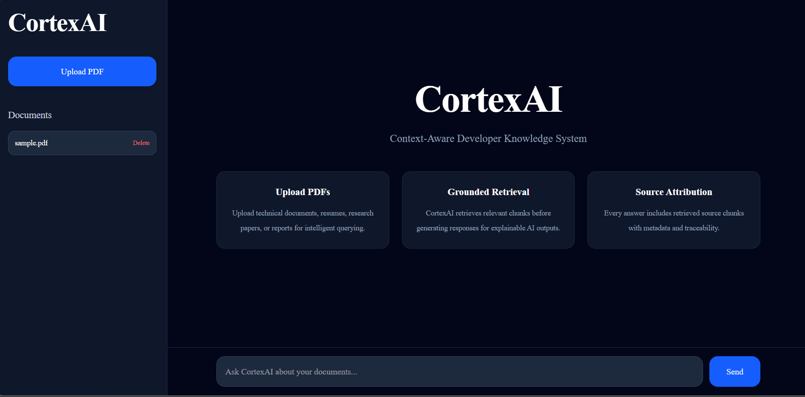
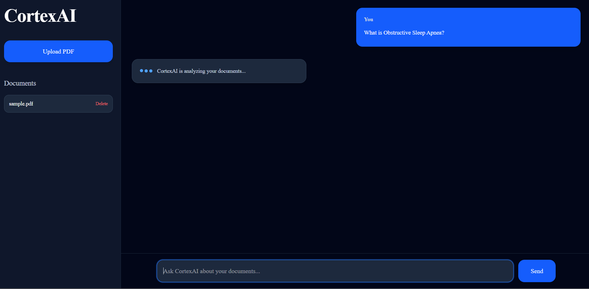
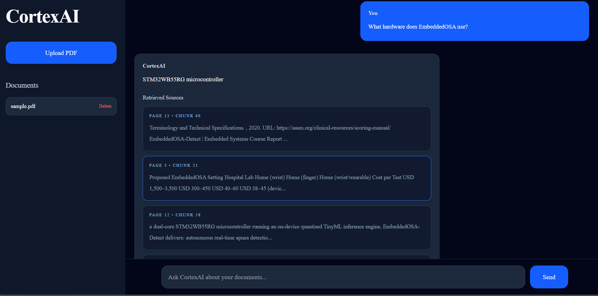

<div align="center">

# 🧠 CortexAI
### Context-Aware Developer Knowledge System

CortexAI is a citation-aware RAG system designed for semantic querying of structured technical and academic documents using local LLM inference and FAISS-based retrieval.

**A full-stack Retrieval-Augmented Generation (RAG) application that lets you upload PDF documents and query them semantically using natural language — with grounded responses and source attribution.**

[](https://react.dev/)
[](https://fastapi.tiangolo.com/)
[](https://tailwindcss.com/)
[](https://www.langchain.com/)
[](https://faiss.ai/)
[](https://huggingface.co/)

</div>

---

## 📸 Screenshots

<div align="center">

### 🏠 Landing Page


### 🔍 Query Interface


### 📊 Results with Source Attribution


</div>

---

## 📖 About the Project

**CortexAI** is a full-stack RAG application built for developers and researchers who need to extract insights from large PDF documents through natural language queries.

A grounded RAG system optimized for structured technical and academic documentation with explainable retrieval and source attribution.

The system:
- Ingests and chunks PDF documents into a FAISS vector store
- Retrieves semantically relevant chunks using embedding similarity search
- Generates grounded, context-aware answers using FLAN-T5
- Returns responses with full source attribution, including page and chunk tracing

> Designed to minimize hallucinations through retrieval grounding and source attribution.

---

## 📌 Optimization Scope

CortexAI is currently optimized for:

- Academic research papers
- Technical documentation
- Engineering reports
- Structured text-heavy PDFs

The system performs best on documents with:
- clear section hierarchy,
- readable formatting,
- machine-readable text,
- semantically coherent content.

Support for scanned PDFs, highly graphical layouts, and complex multi-column documents is planned in future iterations.

---

## ✨ Features

| Feature | Description |
|---|---|
| 📄 **PDF Upload & Ingestion** | Upload structured PDF documents (technical reports, academic papers, documentation) and have them automatically chunked and embedded |
| 🗑️ **Dynamic Document Deletion** | Remove documents and their vectors from the store at any time |
| 🔍 **Semantic Chunk Retrieval** | FAISS-powered similarity search for relevant document sections |
| 🤖 **RAG Pipeline** | Full retrieval-augmented generation with LLM grounding |
| 📌 **Source Attribution** | Every response links back to the exact page and chunk |
| ⚡ **React + Vite Frontend** | Fast, animated UI built with Framer Motion |
| 🚀 **FastAPI Backend** | Asynchronous, high-performance REST API |
| 🧪 **Local LLM Inference** | Runs fully offline using FLAN-T5 — no external API keys needed |
| 🎨 **Animated UI** | Smooth transitions and interactions powered by Framer Motion |
| 🔐 **Env-Based Config** | API endpoints configurable via environment variables |

---

## 🛠️ Tech Stack

### Frontend
- **[React](https://react.dev/)** — UI library
- **[Vite](https://vitejs.dev/)** — Lightning-fast build tool
- **[TailwindCSS](https://tailwindcss.com/)** — Utility-first styling
- **[Framer Motion](https://www.framer.com/motion/)** — Animations and transitions

### Backend
- **[FastAPI](https://fastapi.tiangolo.com/)** — Async Python REST framework
- **[LangChain](https://www.langchain.com/)** — RAG orchestration
- **[FAISS](https://faiss.ai/)** — Vector similarity search
- **[HuggingFace Embeddings](https://huggingface.co/)** — Sentence-level embeddings
- **[FLAN-T5](https://huggingface.co/google/flan-t5-base)** — Local LLM for generation
- **[PyPDFLoader](https://python.langchain.com/docs/modules/data_connection/document_loaders/pdf)** — PDF ingestion

---

## 🏗️ Architecture

```
User Query
    │
    ▼
React Frontend  (Vite + TailwindCSS + Framer Motion)
    │
    ▼  HTTP Request
FastAPI Backend
    │
    ▼
Retriever  (FAISS Vector Store)
    │
    ▼
Relevant Chunks Retrieved  (Top-K Semantic Matches)
    │
    ▼
LLM Generation  (FLAN-T5 Local Inference)
    │
    ▼
Grounded Response + Sources  (Page / Chunk Traced)
```

---

## 📁 Project Structure

```
ai-knowledge-engine/
├── backend/
│   ├── main.py              # FastAPI app entrypoint & route definitions
│   ├── ingestion.py         # PDF loading, chunking, and embedding
│   ├── retriever.py         # FAISS vector store retrieval logic
│   ├── rag_pipeline.py      # End-to-end RAG pipeline orchestration
│   ├── generator.py         # LLM prompt construction and response generation
│   ├── model_loader.py      # FLAN-T5 model and tokenizer initialization
│   ├── faiss_index/         # Persisted FAISS index files
│   ├── data/                # Uploaded PDF storage
│   └── requirements.txt     # Python dependencies
│
├── frontend/
│   ├── src/                 # React components, pages, and hooks
│   ├── public/              # Static assets
│   ├── package.json         # Node dependencies
│   ├── vite.config.js       # Vite configuration
│   └── .env                 # Environment variables
│
├── screenshots/
│   ├── landing.png
│   ├── query.png
│   └── results.png
│
├── README.md
└── .gitignore
```

---

## ⚙️ Setup Instructions

### Prerequisites

Make sure you have the following installed:

- **Python** `3.9+`
- **Node.js** `18+`
- **npm** or **yarn**

---

### 🔧 Backend Setup

```bash
# 1. Navigate to the backend directory
cd backend

# 2. Create a virtual environment
python -m venv venv

# 3. Activate the virtual environment (Windows)
venv\Scripts\activate

# On macOS/Linux:
# source venv/bin/activate

# 4. Install dependencies
pip install -r requirements.txt

# 5. Start the FastAPI server
uvicorn main:app --reload
```

> The backend will be live at: `http://127.0.0.1:8000`  
> Interactive API docs available at: `http://127.0.0.1:8000/docs`

---

### 🎨 Frontend Setup

```bash
# 1. Navigate to the frontend directory
cd frontend

# 2. Install Node dependencies
npm install

# 3. Start the development server
npm run dev
```

> The frontend will be live at: `http://localhost:5173`

---

## 🔐 Environment Variables

Create a `.env` file inside the `frontend/` directory with the following:

```env
VITE_API_URL=http://127.0.0.1:8000
```

| Variable | Description | Default |
|---|---|---|
| `VITE_API_URL` | Base URL for the FastAPI backend | `http://127.0.0.1:8000` |

---

## 🔬 RAG Pipeline — How It Works

```
1. INGESTION
   └─ User uploads a PDF
   └─ PyPDFLoader reads and splits the document into chunks
   └─ HuggingFace Embeddings converts chunks to dense vectors
   └─ Vectors are stored and persisted in a FAISS index

2. RETRIEVAL
   └─ User submits a natural language query
   └─ The query is embedded using the same HuggingFace model
   └─ FAISS performs a Top-K similarity search
   └─ Most relevant chunks are returned

3. GENERATION
   └─ Retrieved chunks are formatted into a prompt
   └─ FLAN-T5 generates a grounded, context-aware response
   └─ Response is returned with source attribution (page + chunk)
```

---

## ✅ Current Capabilities

- [x] Upload and ingest structured PDF documents
- [x] Persistent FAISS vector store across sessions
- [x] Semantic similarity-based chunk retrieval
- [x] Local LLM inference with FLAN-T5 (no API key required)
- [x] Source attribution with page and chunk reference
- [x] Dynamic deletion of uploaded documents
- [x] Animated, responsive React frontend
- [x] Environment-variable driven configuration

---

## ⚠️ Current Limitations

- Retrieval quality depends on document structure and text clarity
- Scanned/image-based PDFs are not yet fully supported
- Very short or highly ambiguous queries may retrieve incomplete context
- Table-heavy or multi-column layouts may reduce retrieval accuracy

---

## 🚀 Future Improvements

- [ ] 🔄 **Multi-modal support** — Add image and table parsing from PDFs
- [ ] 🧠 **Swap LLM backend** — Support OpenAI GPT-4o / Mistral / LLaMA 3
- [ ] 💾 **Persistent chat history** — Store and reload conversation sessions
- [ ] 🗂️ **Multi-document comparison** — Query across multiple uploaded PDFs simultaneously
- [ ] 🌐 **Cloud deployment** — Dockerize and deploy to AWS / GCP / Railway
- [ ] 🔑 **Authentication** — Add user login and per-user document namespacing
- [ ] 📊 **Analytics dashboard** — Track queries, retrieval quality, and token usage
- [ ] 🧪 **Evaluation metrics** — Add RAGAS or TruLens for RAG quality scoring

---

## 👨‍💻 Author

<div align="center">

### Viransh Fauzdar

[](https://github.com/Viransh7)
[](https://www.linkedin.com/in/viransh-fauzdar-499372287/)

*Built to explore grounded AI systems, semantic retrieval, and practical RAG engineering.*

</div>

---

<div align="center">

⭐ **If you found this project helpful, please consider giving it a star!** ⭐

*Made by Viransh Fauzdar*

</div>
